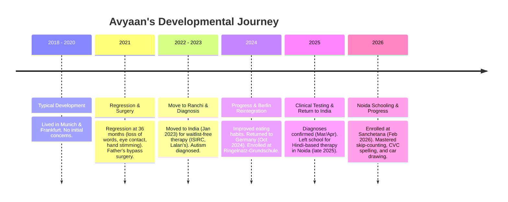

# Avyaan Prasad (Abhyan) - Case Profile & Local Memory

This document serves as the central memory, rules, regulations, and governance system for Avyaan's educational, therapeutic, and administrative profile. It tracks history, constraints, guidelines, and progress to ensure continuity across all sessions and interactions.

---

## 📋 Personal Profile
- **Full Name**: Avyaan Prasad (also referred to as Abhyan)
- **Date of Birth**: 14 July 2018 (6 years old as of early 2025)
- **German Residence**: Büchnerring 38, 13409 Berlin, Germany
- **Current Location**: Gaur City 1, Noida Extension, Greater Noida, UP, India (temporary stay for therapy)
- **Father**: Shashikant Prasad (Software Engineer, currently working in Berlin, Germany; Contact: +49 15140900789)
- **Mother**: Sneha Suman (MBA 2004, stock research background, B2 German; currently caregiving in Noida)
- **Health Insurance**: Techniker Krankenkasse (TK), Insurance Number: Q134237530

---

## 🩺 Clinical Diagnoses (ICD-10)
Based on the medical report dated July 10, 2025, by Dr. med. Basel Allozy:
1. **Early Childhood Autism (F84.0)**: Confirmed via ADI-R (March 20, 2025) and ADOS-2 (April 24, 2025) gold-standard testing.
2. **ADHD / Activity and Attention Disorder (F90.0)**: Characterized by psychomotor restlessness, hyperactivity, and high distractibility.
3. **Mild Intellectual Disability (F70.0)**: Identified with potential for higher achievement if sensory and attention barriers are managed.

---

## 📈 Developmental & Behavioral Timeline

- **Years 1–2 (2018–2020)**: Normal development. Lived in Munich and Frankfurt.
- **Year 3 (2021)**: Developmental regression occurred after 36 months. Stereotypic repetitive hand movements, limited eye contact with strangers, and high distractibility emerged.
- **Year 4 (2022–2023)**: Diagnosed with Autism in early 2023. Relocated to Ranchi, India in January 2023 to access immediate intensive therapy (OT, Sensory Integration, Speech, ABA) at ISIRC and Lalan's Academy, bypassing long German waiting lists.
- **Years 5–6 (Oct 2024 – late 2025)**: Returned to Germany (Oct 20, 2024) and registered in Berlin. Attended Ringelnatz-Grundschule for the 2024/2025 school year. Received 1-on-1 support. Diagnoses finalized in early 2025.
- **Year 7 (Late 2025 – Present 2026)**: Returned to Noida, India (Gaur City 1) for specialized therapy in Hindi. Started at Sanchetana (special wing of Billabong High School) in February 2026.

---

## ⚖️ Administrative Status (Germany & India)

### Germany Status:
- **Kindergeld (Child Benefit)**: Kindergeld Number `004FK322791`. Detailed medical necessity form sent on November 15, 2024. No response or payment since March 2025.
- **LAGESo (Severe Disability Pass)**: File Number `D06 4123028` (PIN `99649`). Application is pending; care insurance (Pflegekasse) details requested.
- **Care Grade / Benefits (Pflegegrad)**: On hold because Avyaan is abroad. Must notify Techniker Krankenkasse (TK) immediately upon return to Germany.
- **eFöB (After-School Care)**: Approved from September 1, 2025, to July 31, 2027. Free of charge for grades 1–3. Needs signature/contract return to Bezirksamt Reinickendorf.
- **Broadcasting Fee (Rundfunkbeitrag)**: Account `329 047 418` balanced and deregistered as of October 2025.
- **Administrative Identifiers**:
  - Tax Office: Finanzamt Reinickendorf (Berlin)
  - File Reference (Aktenzeichen): `17/100/09222 FE6`
  - Shashikant Prasad Tax ID: `18 087 465 321`
  - Sneha Suman Tax ID: `10 439 078 524`

### India Status:
- **UDID Card (Unique Disability ID)**: Application in progress via `swavlambancard.gov.in` using Avyaan's own Aadhaar number. Recommended to apply under the Noida (UP) address to allow local medical assessment and avoid traveling to Jharkhand.

---

## ⚙️ Rules & Governance for AI Interaction

1. **Focus Areas**: Structure all learning and activity suggestions around Sanchetana's three main pillars:
   - **Socialization**: Encourage joint attention, turn-taking, and decoding facial expressions.
   - **Abstract Thinking**: Connect parts of a scene to the whole environment; teach time concepts (yesterday, today, tomorrow) and cognitive flexibility.
   - **Comprehension**: Move from rote execution (copying words/numbers) to functional understanding (why a word is used, what addition represents in real items).
2. **Cognitive Profile Constraints**:
   - **Hypernumeracy & Sequencing**: Lean into his love of numbers as a bridge for communication.
   - **Visual Rote Memory**: Leverage his visual strengths but challenge him to generalize.
   - **Sensory Processing (Food)**: Avoid forcing solid textures; respect his rigid eating pattern (prefers soft, mashed foods like dal-chawal) while slowly introducing new textures.
   - **Boundary (Solo Drawing)**: Respect his need to draw alone to decompress. Do not force collaborative games during his independent drawing time.
   - **OS Preference**: Provide technical and digital recommendations compatible with **Windows** (avoid MacBook suggestions).
3. **Tone & Style**: Direct, practical, and realistic. Avoid over-optimistic or flowery encouragement.

---

## 🧩 Action Plans & Behavioral Strategies

### 1. Socialization & Play Strategies
- **"Pass the Pencil" Collaborative Drawing**: Establish a 2-column page ("Dad's Turn" / "Avyaan's Turn"). Draw one part of a structure (e.g., base of a truck) and pass the pencil to have him copy/add.
- **"Read Dad's Face" Game**: Draw a face template with empty features. Exaggerate an expression (e.g., happy smile) and have Avyaan draw the missing eyes/mouth based on what he sees on your face.
- **Toys & Games**: Focus on Connect 4, Jenga (Tumble Tower), Magnetic Tiles/Lego (with parent acting as the "Component Supplier"), and Xylophone or Bongo Drums ("Copy My Rhythm" game).

### 2. Digital & Hardware Setup
- **Windows Mini PC Setup**: Recommending an x86 Intel N100 or AMD Ryzen 5 Mini PC (16GB RAM, 512GB SSD) to run local databases (MySQL/PostgreSQL), Power BI, Tableau, Jupyter Notebooks, and Chrome.
- **Drawing Tools**: A3 Portable Drafting Board (Isomars) with parallel motion, 0.7mm Mechanical Pencils, and Isometric/Grid Graph paper to practice technical and architectural drawing.
- **Lighted Keyboards**: Casio Casiotone LK-S250 or Yamaha EZ-300/310 to support visual tracking and finger isolation/tripod grasp.

### 3. Sensory Substitutes & Daily Routines
- **Hair-Touching / Kissing (Sensory Seeking)**: Provide a "sensory substitute" (doll head with long soft hair, soft makeup brush, or silk cloth) before going to malls/crowded places. Teach "Mommy/Sister hair - YES, Outside hair - NO."
- **Mobile Screen Regulation**: 
  - *Speech*: Use the phone recording as a reward. Prompt him to name the action before hitting record (e.g., "Say: Drink mango juice").
  - *Visual*: Substitute the camera screen with a large wall mirror to provide the same self-monitoring feedback without the device.

---

## 🪵 Session Log & Context Log

### Session 1: 2026-07-19
- **Goal**: Initialize the project space and local memory.
- **Actions Taken**:
  - Created the project directory: `avyaans_learning/`
  - Initialized `antigravity.md` to track rules and context.
- **Key Decisions**:
  - Use `antigravity.md` as the source of truth for the project context.

### Session 2: 2026-07-19
- **Goal**: Consolidate case records and timeline.
- **Actions Taken**:
  - Reviewed the 11-page and 80-page history documents uploaded by the user detailing Avyaan's history from 2018 to 2026.
  - Fully populated `antigravity.md` with his medical profile, diagnostic records, administrative statuses (Germany and India), and active educational/therapeutic strategies.

### Session 3: 2026-07-19
- **Goal**: Restructure folders and rename workspace to reflect correct spelling.
- **Actions Taken**:
  - Renamed the main folder from `avyans_learning` to `avyaans_learning`.
  - Created `input` and `output` folders.
  - Copied user-attached medical, timeline, and education plan PDFs to the `input` directory.
- **Key Decisions**:
  - Store incoming medical, educational, and behavioral PDFs in the `input` folder for easy access and reference.
