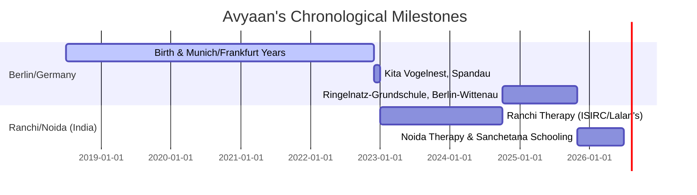

# Avyaan Prasad - Comprehensive Chronological Timeline (2018–2026)

This document consolidates every biographical, medical, educational, travel, and therapeutic detail provided for Avyaan Prasad across all records (including consolidated chat histories, school diaries, and transition documents). No detail has been omitted or summarized away; instead, they are structured chronologically to preserve the complete history of Avyaan's developmental journey.

---

## 📌 Timeline Overview

---

## 📅 Chronological Detail by Year

### 👶 2018: Birth & Infancy
- **July 14, 2018**: Avyaan Prasad is born.
- **Location**: Munich, Germany.
- **First Year (0–12 Months)**:
  - Development was noted as active, happy, and typical. 
  - He ate well, played, and engaged in regular infant activities.
  - *Parental Note*: While other infants around 7–8 months old might have displayed more intense responsiveness to social cues and human behavior, Avyaan was simply a happy, easygoing baby who played and ate without showing any warning signs that would suggest developmental or autistic differences.

---

### 🧸 2019–2020: Early Childhood & Early Skills
- **Location**: Munich and Frankfurt, Germany.
- **Move to Frankfurt**: In approximately November 2020, the family relocated from Munich to Frankfurt due to a school/job transfer. (He had secure admission in Munich but had to leave it for this move).
- **Impact of Corona Pandemic**: The onset of the pandemic meant the family spent a significant amount of time isolated at home.
- **Skills at Age 2 to 2.5**:
  - Avyaan possessed a highly active rote memory (**Hyperlexia** and **Good Rote Memory**).
  - He knew his own name and his entire family tree (could recite the names of all relatives on his father's side, grandfather's name, and details of village life in India).
  - He easily memorized and recited standard nursery rhymes.
  - He could count and recite numbers. He would stand, hold the wall with one hand for support, and recite numbers from 1 to 100 perfectly.
  - **Flag & Number Cards**: His father printed out numbers (1 to 100) and names/flags of different countries on A4 sheets. Avyaan would look at them, point to each one, and say what they were.
  - **Visual Recognition**: Using a 500-word picture book, he could point to and name any item shown in the pictures.
  - **Language Preference**: He displayed a strong natural preference for English words and sounds over Hindi, showing high interest in English nursery rhymes and visual content online.
  - **TV/Music Interest**: He loved watching song videos on the TV and would actively try to mimic the dance steps, showing a strong response to musical rhythms.

---

### ⚡ 2021: Father's Surgery & First Signs of Regression
- **Location**: Germany (Frankfurt/Berlin).
- **March 20–21, 2021**: Avyaan's father undergoes bypass surgery.
- **Developmental Regression (Age 3 onwards)**:
  - Following the father's surgery and the associated family stress, Avyaan was isolated at home for about 5–6 months.
  - He experienced a noticeable regression (loss of previously acquired skills).
  - He lost interest in reciting the names of relatives and country flags. When shown cards or asked "Who is this?", he ignored them.
  - He stopped speaking in the structured way he did before and withdrew into his own world.
  - **Behavioral Changes**: Developed stereotypic repetitive hand movements (hand stimming), limited eye contact (especially with strangers), and high distractibility.
  - **Sensory Issues with Food**:
    - Developed severe **Sensory Feeding Issues**. He refused to eat solid foods, throwing tantrums during meals.
    - He would only eat very soft or mashed foods, biscuits, and chocolates. He had difficulty swallowing texturized food and would gag or spit it out.
  - **First Kindergarten Experience**:
    - He was enrolled in a local kindergarten, but the teachers noted that his behavior was highly different from his peers.
    - While he talked a bit at home, he was silent and isolated in class.
    - Due to these difficulties, he was eventually taken out of this school.

---

### 🚗 2022: Kindergarten & Pattern Play
- **Location**: Lived in Berlin (Achenbachstraße 11), Germany.
- **School**: Enrolled at the **"Kita Vogelnest"** in Spandau, Berlin.
- **Behavior & Patterns**:
  - He loved patterns and solving puzzles, moving pieces back and forth systematically until they were solved.
  - **Eating Intervention**: Out of frustration with his severe food refusal, his father briefly used strict, forceful methods (locking him in a room and insisting he eat roti, sabji, and dal). Avyaan began eating these foods, but the father realized he was doing so out of fear and immediately stopped using physical force or punishment, shifting to gentler approaches.
  - **The Toy Train**: His father bought him a remote-controlled, battery-operated German toy train. Avyaan loved placing it on the tracks and watching it spin in circles for hours. This predictable, repetitive visual motion calmed his brain (visual stimming). When the train was later returned/removed, he lost this safe space and became dysregulated.
- **Exemptions & Appointments**: The family spent over a year trying to secure diagnostic consultations and support in Berlin, but were repeatedly told that waitlists were at least a year long.

---

### ✈️ 2023: Relocation to Ranchi, India & Intensive Therapy
- **January 30, 2023**: Lived in Berlin, then boarded a 14-hour flight to India for a planned short holiday.
- **Flight Trauma**: Avyaan experienced extreme distress, flight anxiety, and sensory overload at the airport and inside the cabin. He cried, stamped his feet, and slept tightly in his mother's lap for the entire 14 hours out of fear.
- **Strategic Decision**: Because of the long diagnostic waitlists in Germany, the parents decided to stay in India to access immediate therapy.
- **Ranchi Stay (January 2023 – October 2024)**:
  - Enrolled at **ISIRC** (Institute of Sensory Integration & Research Centre) and **Lalan's Academy** in Ranchi (Jharkhand) for intensive therapies (Occupational Therapy, Speech Therapy, Sensory Integration, and ABA).
  - Enrolled in a local play school in Ranchi. The parents chose not to disclose his autism diagnosis initially to see how the teachers perceived him naturally.
  - **Rigid Diet**: His eating remained highly rigid. For lunch, he would only eat rice, dal, and a single raw/lightly-cooked vegetable ("kachhi sabji"). This strict pattern lasted throughout 2023 and most of 2024.
  - **Language of Therapy**: Therapies were conducted in his mother tongue, **Hindi**, without medication. Pushing the therapy in Hindi led to faster developmental progress since he could understand the therapists clearly.
  - **Travel Logs**:
    - **January 2023**: Family relocated to India.
    - **August 2023**: Father visited the family in India.
    - **August 23, 2023**: Diagnostic certificate confirmed the necessity of regular, ongoing therapeutic treatment.

---

### 🔄 2024: Ranchi Progress & Return to Germany
- **Location**: Ranchi, India, then Berlin, Germany.
- **Travel Logs (Father's commute to maintain family bond)**:
  - **February 2024**: Travel from India to Berlin.
  - **April 2024**: Travel from Berlin to India.
  - **June 2024**: Travel from India to Berlin.
  - **September 2024**: Travel from Berlin to India.
  - **October 2024**: Family returned to Berlin together.
- **Developmental Progress**:
  - By mid-2024, Avyaan's eating rigidity began to ease. He started eating a bit of dinner at night with his father.
- **October 20, 2024**: Avyaan returns to Germany.
- **October 24, 2024**: Officially re-registered (Anmeldung) at Büchnerring 38, 13409 Berlin, Germany.
- **School**: Enrolled at the **Ringelnatz-Grundschule** in Berlin-Wittenau for the 2024/2025 academic year.
- **Child Benefit (Kindergeld)**: On November 15, 2024, a detailed response explaining the medical necessity of the India stay was sent to the Familienkasse.

---

### 🩺 2025: Official Diagnoses & Return to India
- **Location**: Berlin, Germany, then Gaur City 1, Noida, India.
- **German Schooling & Support**:
  - Attended Ringelnatz-Grundschule. Showed progress in developing routines and confidence, though he required individual special support (Sonderpädagogische Förderung). 
  - He displayed a strong urge to move during lessons and breaks and could not participate in regular lessons without assistance.
  - **After-School Care (eFöB)**: Approved for supplementary after-school care from September 1, 2025, to July 31, 2027.
- **Official Diagnoses**:
  - **March 20, 2025**: Early Childhood Autism (F84.0) confirmed via ADI-R.
  - **April 24, 2025**: Autism confirmed via ADOS-2.
  - **May 22, 2025**: SON-R non-verbal intelligence testing performed. Confirmed potential for higher achievement but highlighted severe distractibility.
  - **July 10, 2025**: Official medical report issued by Dr. med. Basel Allozy confirming Autism (F84.0), ADHD (F90.0), and Mild Intellectual Disability (F70.0).
- **Administrative Status**:
  - **Severe Disability Pass (LAGESo)**: File D06 4123028 (PIN 99649) application submitted; pending insurance details.
  - **Care Grade (Pflegegrad)**: Assessment put on hold because Avyaan returned to India.
  - **Rundfunkbeitrag**: Deregistered in October 2025.
- **Second Relocation to India (Late 2025)**:
  - Relocated to Gaur City 1, Greater Noida, for further specialized therapies in Hindi.
  - Enrolled in specialized local development centers: **Nurturers** and **My Therapist Development Center** (specialized Autism/ADHD support).
  - Participated in physical activities like skating at the **Rollinround Skating Academy** in Gaur City Mall (helping with balance and sensory input).

---

### 🏫 2026: Sanchetana (Noida) & Current Behaviors
- **Location**: Gaur City 1, Noida Extension, India.
- **School**: Enrolled in **Sanchetana** (the special education wing of Billabong High School) in Greater Noida starting February 2026. Ms. Khushbi Sethi is assigned as his special educator for the 2026–2027 academic session.
- **School Performance (April – May 2026)**:
  - **OT Focus**: Sensory diet, midline walking, tripod grasp, visual tracking, bilateral coordination, and scissor skills (cutting paper).
  - **Speech Focus**: Sentence structures, understanding "Wh-" questions, action verbs, and kinship items.
  - **Academic Progress**: Achieved 100% accuracy on vertical single-digit addition. Demonstrated complete mastery of skip-counting by 2s and 3s (even from non-standard bases like 52, 55, 58...).
  - **Drawing Milestones**: Showed exceptional geometric scanning. Successfully copied clean 2D worksheets (trucks, robots, boats). Drew a highly detailed 3D ride-on toy car, accurately capturing the happy-face and sad-face patterns on the front and rear wheel hubcaps respectively.
- **Current Behavioral & Sensory Profile**:
  - **Hypernumeracy**: Displays an intense fascination with numbers. Spends time typing numbers (1 to 100) or years (2026, 2025, 2024) on the phone screen to create order and calm his mind.
  - **Verbal Stimming & Echolalia**: Repeatedly chants numbers and scripted phrases like *"7171 A71 Hai 7171 71 Ho Gaya"* (71 is done) and *"No 7 No 7 No 7"*.
  - **Video Recording**: Insists on turning on the mobile camera and recording himself performing daily tasks (like drinking mango juice) to gain visual feedback and make his actions feel safe and predictable.
  - **Sensory Seeking (Hair-Touching)**: Frequently touches and kisses long hair (of family members and occasionally female strangers in public places like malls) to seek soft tactile, olfactory (shampoo/perfume), and lip-pressure sensations.
  - **Summer Vacation**: Began summer break on May 25, 2026.
- **Current Objectives**: Setting up a permanent Windows Mini PC station at home, acquiring a lighted keyboard (Casio LK-S250 or Yamaha EZ-300), and preparing the A3 drafting board setup for solo blueprint drawing.

---

## 🔍 Confirmation of Detailed Story Coverage
*As requested by the user, here is the confirmation of the narrative coverage:*

> [!IMPORTANT]
> **Story Coverage Confirmation**: 
> - **Detailed Narrative Story**: Your personal, narrative recollections (first words, regression details, Ranchi play school details, food struggles, train play, and travel details) are covered in rich detail up to **late 2024** (up to the point where the family returned to Berlin in October 2024).
> - **2025 to 2026 (The Current Era)**: The detailed story for these years is derived from official clinical diagnostics (Dr. Allozy's July 2025 report), school diaries (Sanchetana logs from April–May 2026), and administrative documents. There is **no narrative chat story** from you covering the late 2024 to late 2025 gap.
